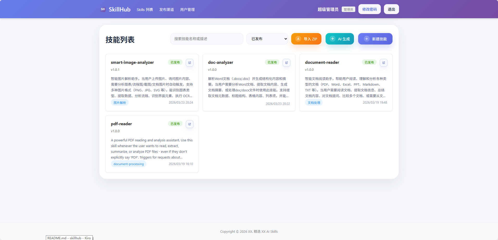

<p align="center">
  
</p>

<h1 align="center">SkillHub</h1>

<p align="center">
  <strong>AI Skill 管理与发布平台</strong><br>
  创建、管理、发布结构化 AI Skill 文档，支持 AI 一键生成与多渠道分发
</p>

<p align="center">
  <a href="#快速开始">快速开始</a> •
  <a href="#功能特性">功能特性</a> •
  <a href="#docker-部署">Docker 部署</a> •
  <a href="#发布渠道">发布渠道</a> •
  <a href="#api-文档">API 文档</a>
</p>

---

## 什么是 SkillHub？

SkillHub 是一个用于管理 AI "Skill"（结构化 Markdown 文档 + 元数据）的 Web 平台。你可以把它理解为 AI 技能的 CMS —— 创建、编辑、版本管理，然后一键发布到 GitHub、GitLab、SSH 服务器等多种渠道。

核心场景：
- 团队协作管理大量 AI Prompt / Skill 文档
- 通过 AI 辅助快速生成高质量 Skill
- 统一发布到多个目标平台，保持版本一致性

## 功能特性

- **Skill 管理** — 创建、编辑、搜索、分页浏览，支持 ZIP 导入导出
- **AI 生成** — 一句话描述，自动生成 Skill 内容和辅助文件（SSE 流式输出）
- **多渠道发布** — 本地 / 远程 API / GitLab / GitHub / SSH(SFTP)，五种渠道开箱即用
- **文件管理** — 脚本、参考资料、附件，支持自定义目录（最多三级）
- **用户认证** — JWT 认证，管理员 / 普通用户两种角色
- **安全存储** — 渠道敏感信息使用 AES-256-GCM 加密
- **Markdown 预览** — SKILL.md 源码与渲染双视图
- **子路径部署** — 支持 `BASE_URL` 配置，可部署在反向代理子路径下

## 技术栈

| 层级 | 技术 |
|------|------|
| 前端 | React 18 · React Router v6 · Vite 5 · Axios |
| 后端 | Node.js · Express · MySQL · JWT · Multer |
| AI | OpenAI 兼容 API（流式 SSE） |
| 部署 | Docker · Nginx · 多阶段构建 |
| 测试 | Vitest · fast-check |

## 快速开始

### 环境要求

- Node.js 18+
- MySQL 5.7+

### 本地开发

```bash
# 克隆项目
git clone https://github.com/your-username/skillhub.git
cd skillhub

# 安装依赖
npm install
cd client && npm install && cd ..

# 初始化数据库
mysql -u root -p < server/db/init.sql

# 配置环境变量
cp server/.env.example server/.env.development
# 编辑 server/.env.development，填写数据库连接和 JWT_SECRET

# 启动后端（端口 3030）
npm run dev:server

# 启动前端（端口 3000，自动代理 /api 到后端）
npm run dev:client
```

访问 http://localhost:3000


### 默认账户

| 用户名 | 密码 | 角色 |
|--------|------|------|
| admin | abc123 | 管理员 |

> ⚠️ 首次登录后请立即修改默认密码

## Docker 部署

```bash
# 1. 复制并编辑环境变量
cp .env.example .env
# 必须修改: JWT_SECRET, MYSQL_PASSWORD

# 2. 构建并启动
docker-compose up -d --build

# 3. 查看日志
docker-compose logs -f app
```

服务默认在 `http://localhost:80` 启动。

### 子路径部署

如需部署在反向代理子路径下（如 `/skillhub/`）：

```bash
BASE_URL=/skillhub/ docker-compose up -d --build
```

### 环境变量

| 变量 | 必填 | 默认值 | 说明 |
|------|:----:|--------|------|
| `JWT_SECRET` | ✅ | — | JWT 认证密钥，使用随机字符串 |
| `MYSQL_PASSWORD` | ✅ | skillhub_password | MySQL 用户密码 |
| `MYSQL_ROOT_PASSWORD` | — | root_password | MySQL root 密码 |
| `PORT` | — | 80 | 服务端口 |
| `BASE_URL` | — | / | 部署子路径（如 `/skillhub/`） |
| `ENCRYPTION_KEY` | — | 内置默认 | AES-256 加密密钥（生产环境建议配置） |
| `AI_API_KEY` | — | — | OpenAI 兼容 API Key |
| `AI_API_BASE_URL` | — | https://api.openai.com/v1 | AI API 地址 |
| `AI_MODEL` | — | gpt-4o | AI 模型名称 |
| `MAX_FILE_SIZE` | — | 2 | 单文件上传限制（MB） |
| `MAX_ZIP_SIZE` | — | 10 | ZIP 包上传限制（MB） |

### 数据持久化

| 路径 | 说明 |
|------|------|
| `./skills` | Skill 文件存储 |
| `./data` | 应用数据 |
| `./logs` | 日志文件 |
| `mysql_data` | MySQL 数据（Docker volume） |

### 常用命令

```bash
docker-compose up -d          # 启动
docker-compose down            # 停止
docker-compose down -v         # 停止并清除数据
docker-compose build --no-cache # 重新构建
docker exec -it skillhub sh    # 进入容器
```

## 项目结构

```
skillhub/
├── server/                    # Express 后端 (CommonJS)
│   ├── index.js               # 入口，中间件，路由挂载
│   ├── db.js                  # MySQL 连接与初始化
│   ├── routes/                # API 路由
│   │   ├── skills.js          # Skill CRUD
│   │   ├── publish.js         # 发布/下架
│   │   ├── channels.js        # 渠道管理
│   │   └── ai.js              # AI 生成（SSE）
│   ├── services/
│   │   └── aiService.js       # LLM 集成（流式解析）
│   ├── channels/              # 发布渠道实现
│   │   ├── base.js            # 抽象基类
│   │   ├── local.js           # 本地文件系统
│   │   ├── remote.js          # 远程 API
│   │   ├── gitlab.js          # GitLab
│   │   ├── github.js          # GitHub
│   │   └── ssh.js             # SSH/SFTP
│   └── skill-creator/         # AI 提示词模板
├── client/                    # React SPA (ES Modules)
│   ├── src/
│   │   ├── App.jsx            # 路由配置
│   │   ├── api.js             # API 客户端
│   │   ├── components/        # 通用组件
│   │   └── pages/             # 页面组件
│   └── vite.config.js         # Vite 配置（含 API 代理）
├── docker/                    # Docker 配置
│   ├── nginx.conf             # Nginx 反向代理
│   └── start.sh               # 容器启动脚本
├── Dockerfile                 # 多阶段构建
└── docker-compose.yml         # 编排配置
```

## Skill 文件结构

每个 Skill 是一个目录，核心文件为 `SKILL.md`：

```
{skill-id}/
├── SKILL.md              # 内容（YAML frontmatter + Markdown 正文）       # 元数据
├── scripts/              # 脚本文件 (.py, .sh, .js ...)
├── references/           # 参考资料 (.md, .txt, .json ...)
├── assets/               # 附件（图片、PDF ...）
└── custom-dir/           # 自定义目录（最多三级）
```

SKILL.md 格式：

```markdown
---
name: my-skill-name
description: 技能描述
---

# 正文内容

Markdown 格式的 Skill 说明...
```

> `name` 只能包含字母、数字和连字符（`-`）

## 发布渠道

SkillHub 支持五种发布渠道，所有渠道的敏感配置（token、password 等）均加密存储。

### 本地发布

发布到本地目录，输出格式为 `{技能名}@{版本号}/`。

### GitLab

发布到 GitLab 仓库（支持自托管实例），需要 Personal Access Token（api 权限）。

### GitHub

发布到 GitHub 仓库，需要 Personal Access Token（repo 权限）。

### SSH/SFTP

通过 SSH 发布到远程服务器，支持密码和私钥两种认证方式。

### 远程 API

将 Skill 打包为 ZIP 发送到自定义 API 端点，适合对接内部系统。

发布接口接收 `multipart/form-data`：
- `skill`: ZIP 文件
- `metadata`: JSON 字符串 `{id, name, description, version, category}`

## 扩展发布渠道

新建渠道只需两步：

1. 继承 `server/channels/base.js` 的 `BaseChannel`，实现 `publish` / `unpublish` / `testConnection` 方法
2. 在 `server/channels/index.js` 中注册

```javascript
// server/channels/my-channel.js
const BaseChannel = require('./base');

class MyChannel extends BaseChannel {
  async publish(skillDir, metadata) { /* ... */ }
  async unpublish(metadata) { /* ... */ }
  async testConnection() { /* ... */ }
}

module.exports = MyChannel;
```

## API 文档

### 认证

| 方法 | 路径 | 说明 |
|------|------|------|
| POST | `/api/auth/login` | 登录，返回 JWT Token |
| GET | `/api/auth/me` | 获取当前用户信息 |
| PUT | `/api/auth/password` | 修改密码 |

### Skill 管理

| 方法 | 路径 | 说明 |
|------|------|------|
| GET | `/api/skills` | 列表（分页、搜索、筛选） |
| GET | `/api/skills/:id` | 详情 |
| POST | `/api/skills` | 创建 |
| PUT | `/api/skills/:id` | 更新 |
| DELETE | `/api/skills/:id` | 删除 |
| GET | `/api/skills/:id/download` | 下载 ZIP |
| POST | `/api/skills/import-zip` | 导入 ZIP |

### 文件管理

| 方法 | 路径 | 说明 |
|------|------|------|
| GET | `/api/skills/:id/:type` | 获取文件列表（scripts/references/assets） |
| PUT | `/api/skills/:id/:type/:filename` | 保存文件 |
| DELETE | `/api/skills/:id/:type/:filename` | 删除文件 |
| POST | `/api/skills/:id/assets` | 上传附件 |

### 发布

| 方法 | 路径 | 说明 |
|------|------|------|
| POST | `/api/skills/:id/publish` | 发布到指定渠道 |
| POST | `/api/skills/:id/unpublish` | 下架 |
| GET | `/api/skills/:id/records` | 发布记录 |

### 渠道

| 方法 | 路径 | 说明 |
|------|------|------|
| GET | `/api/channels` | 渠道列表 |
| POST | `/api/channels` | 创建渠道 |
| PUT | `/api/channels/:id` | 更新渠道 |
| DELETE | `/api/channels/:id` | 删除渠道 |
| POST | `/api/channels/:id/test` | 测试连接 |

### AI 生成

| 方法 | 路径 | 说明 |
|------|------|------|
| POST | `/api/ai/generate` | AI 生成 Skill（SSE 流式） |

### 用户管理（管理员）

| 方法 | 路径 | 说明 |
|------|------|------|
| GET | `/api/users` | 用户列表 |
| POST | `/api/users` | 创建用户 |
| PUT | `/api/users/:id` | 更新用户 |
| DELETE | `/api/users/:id` | 删除用户 |
| PUT | `/api/users/:id/reset-password` | 重置密码 |

## 开发

```bash
npm run dev:server    # 启动后端（端口 3030）
npm run dev:client    # 启动前端（端口 3000）
npm test              # 运行测试
npm run build:client  # 构建前端生产版本
```

### 关键约定

- 后端路由挂载在 `/api/` 下
- 数据库操作使用 `mysql2`（异步）
- 前端 API 调用统一通过 `client/src/api.js`
- 测试文件与源码同目录，命名 `*.test.js`

项目图片


## License

[MIT](LICENSE)
